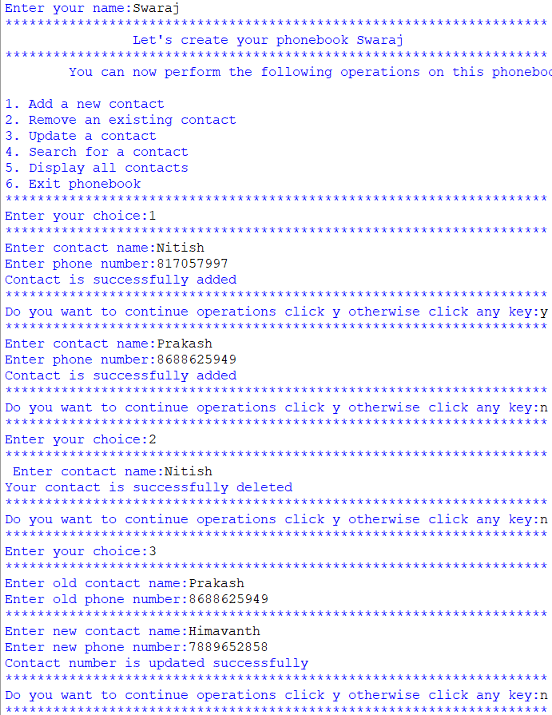

# Phone-Book-Mangement-System
This is a phone Book in which we can perform CRUD operations by using Doubly Linked List
It will collects the Contact data from the users
This Project will teaches us about operations Like Adding, Deleting, Searching, Deleting, Storing into CSV file and Doubly Linked list
In this programme intially its ask your name and then based on your choice user should select the CRUD operation
Based on the choice user can delete the contact or add a new contact or Search for Existing contact and store it on CSV file.

